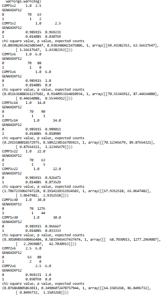

# Background
to see there is correlation between smoking frequency and generalized anxiety based on Chi Square test of Independence

# Conclusion
- there is no correlation between smoking frequency and generalized anxiety

# Analysing process
### 1. data interpretation: 
- GENAXDXP12: generalized anxiety(yes/no)
- S3AQ3B1: frequency of smoking
- S3AQ3C1: usual quantity when smoking
### 2. results
- p_value equals 0.109, bigger than 0.05,which means not all 'frequency of smoking' has correlation with 'generalized anxiety'


- use post hoc test to see the correlation between either two groups. p_values are all bigger then 0.05, which means either two groups has no correlation.



```
import pandas
import numpy
import scipy.stats
import seaborn
import matplotlib.pyplot as plt

data = pandas.read_csv('nesarc.csv', low_memory=False)

""" setting variables you will be working with to numeric
10/29/15 note that the code is different from what you see in the videos
 A new version of pandas was released that is phasing out the convert_objects(convert_numeric=True)
It still works for now, but it is recommended that the pandas.to_numeric function be
used instead """ 

# new code setting variables you will be working with to numeric
data['GENAXDXP12'] = pandas.to_numeric(data['GENAXDXP12'], errors='coerce')
data['CHECK321'] = pandas.to_numeric(data['CHECK321'], errors='coerce')
data['S3AQ3B1'] = pandas.to_numeric(data['S3AQ3B1'], errors='coerce')
data['S3AQ3C1'] = pandas.to_numeric(data['S3AQ3C1'], errors='coerce')
data['AGE'] = pandas.to_numeric(data['AGE'], errors='coerce')

#subset data to young adults age 18 to 25 who have smoked in the past 12 months
sub1=data[(data['AGE']>=18) & (data['AGE']<=25) & (data['CHECK321']==1)]

#make a copy of my new subsetted data
sub2 = sub1.copy()

# recode missing values to python missing (NaN)
sub2['S3AQ3B1']=sub2['S3AQ3B1'].replace(9, numpy.nan)
sub2['S3AQ3C1']=sub2['S3AQ3C1'].replace(99, numpy.nan)

#recoding values for S3AQ3B1 into a new variable, USFREQMO
recode1 = {1: 30, 2: 22, 3: 14, 4: 6, 5: 2.5, 6: 1}
sub2['USFREQMO']= sub2['S3AQ3B1'].map(recode1)

# contingency table of observed counts
ct1=pandas.crosstab(sub2['GENAXDXP12'], sub2['USFREQMO'])
print (ct1)

# column percentages
colsum=ct1.sum(axis=0)
colpct=ct1/colsum
print(colpct)

# chi-square
print ('chi-square value, p value, expected counts')
cs1= scipy.stats.chi2_contingency(ct1)
print (cs1)

# set variable types 
sub2["USFREQMO"] = sub2["USFREQMO"].astype('category')
# new code for setting variables to numeric:
sub2['GENAXDXP12'] = pandas.to_numeric(sub2['GENAXDXP12'], errors='coerce')

# old code for setting variables to numeric:
#sub2['TAB12MDX'] = sub2['TAB12MDX'].convert_objects(convert_numeric=True)

# graph percent with nicotine dependence within each smoking frequency group 
seaborn.factorplot(x="USFREQMO", y="GENAXDXP12", data=sub2, kind="bar", ci=None)
plt.xlabel('Days smoked per month')
plt.ylabel('Proportion Generalized Anxiety Disorder')

recode2 = {1: 1, 2.5: 2.5}
sub2['COMP1v2']= sub2['USFREQMO'].map(recode2)

# contingency table of observed counts
ct2=pandas.crosstab(sub2['GENAXDXP12'], sub2['COMP1v2'])
print (ct2)

# column percentages
colsum=ct2.sum(axis=0)
colpct=ct2/colsum
print(colpct)

print ('chi-square value, p value, expected counts')
cs2= scipy.stats.chi2_contingency(ct2)
print (cs2)

recode3 = {1: 1, 6: 6}
sub2['COMP1v6']= sub2['USFREQMO'].map(recode3)

# contingency table of observed counts
ct3=pandas.crosstab(sub2['GENAXDXP12'], sub2['COMP1v6'])
print (ct3)

# column percentages
colsum=ct3.sum(axis=0)
colpct=ct3/colsum
print(colpct)

print ('chi-square value, p value, expected counts')
cs3= scipy.stats.chi2_contingency(ct3)
print (cs3)

recode4 = {1: 1, 14: 14}
sub2['COMP1v14']= sub2['USFREQMO'].map(recode4)

# contingency table of observed counts
ct4=pandas.crosstab(sub2['GENAXDXP12'], sub2['COMP1v14'])
print (ct4)

# column percentages
colsum=ct4.sum(axis=0)
colpct=ct4/colsum
print(colpct)

print ('chi-square value, p value, expected counts')
cs4= scipy.stats.chi2_contingency(ct4)
print (cs4)

recode5 = {1: 1, 22: 22}
sub2['COMP1v22']= sub2['USFREQMO'].map(recode5)

# contingency table of observed counts
ct5=pandas.crosstab(sub2['GENAXDXP12'], sub2['COMP1v22'])
print (ct5)

# column percentages
colsum=ct5.sum(axis=0)
colpct=ct5/colsum
print(colpct)

print ('chi-square value, p value, expected counts')
cs5= scipy.stats.chi2_contingency(ct5)
print (cs5)

recode6 = {1: 1, 30: 30}
sub2['COMP1v30']= sub2['USFREQMO'].map(recode6)

# contingency table of observed counts
ct6=pandas.crosstab(sub2['GENAXDXP12'], sub2['COMP1v30'])
print (ct6)

# column percentages
colsum=ct6.sum(axis=0)
colpct=ct6/colsum
print(colpct)

print ('chi-square value, p value, expected counts')
cs6= scipy.stats.chi2_contingency(ct6)
print (cs6) 

recode7 = {2.5: 2.5, 6: 6}
sub2['COMP2v6']= sub2['USFREQMO'].map(recode7)

# contingency table of observed counts
ct7=pandas.crosstab(sub2['GENAXDXP12'], sub2['COMP2v6'])
print (ct7)

# column percentages
colsum=ct7.sum(axis=0)
colpct=ct7/colsum
print(colpct)

print ('chi-square value, p value, expected counts')
cs7=scipy.stats.chi2_contingency(ct7)
print (cs7)

```